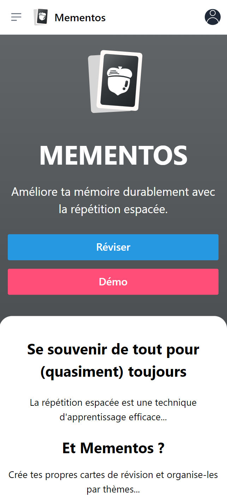
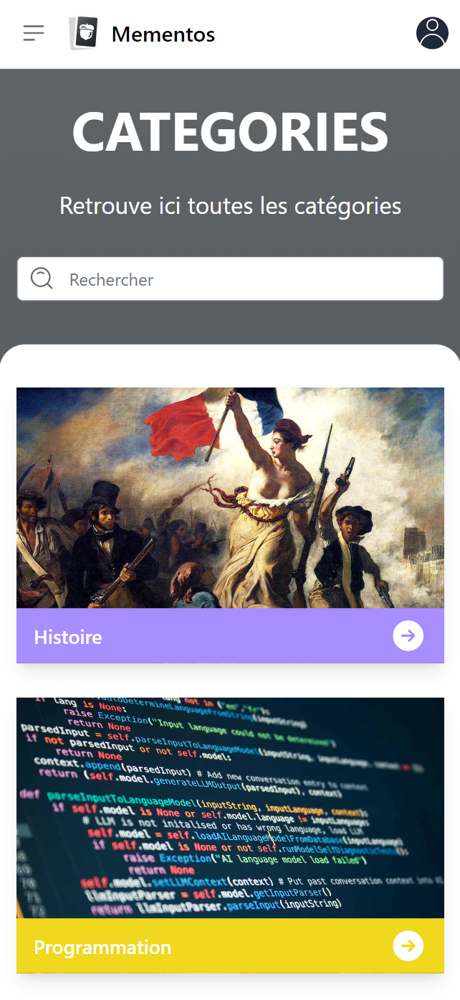
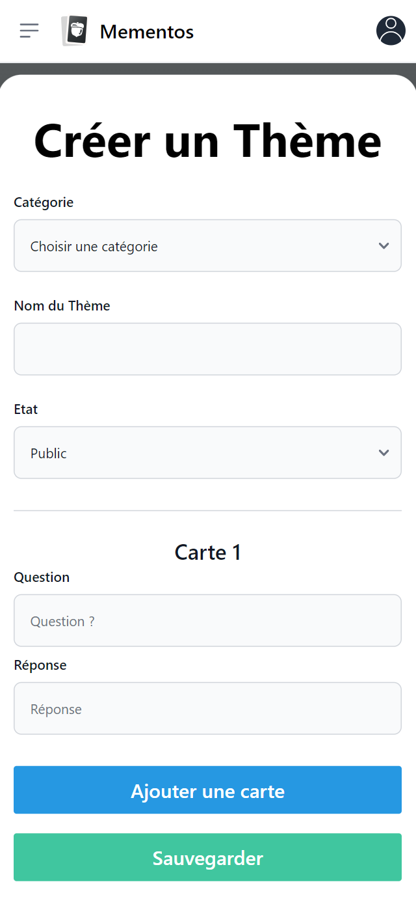
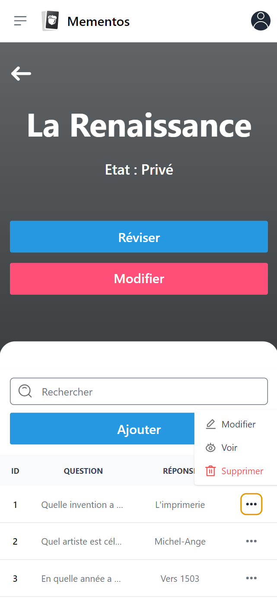

<p align="center"><a href="https://laravel.com" target="_blank"></a></p>

<h1 align="center">MEMENTOS (Backend)</h1><br>

# Projet de Mémorisation </br> Basée sur la Répétition Espacée🧙‍♂️

L'objectif de ce projet est de concevoir et développer une application de mémorisation basée sur la répétition espacée. Le principe de la répétition espacée est détaillé [ici](https://ncase.me/remember/fr.html).

Cette application permet à l'utilisateur de créer un programme de révision personnalisé. Les utilisateurs choisissent le nombre de cartes à réviser chaque jour selon une formule de progression exponentielle, `2^(N-1)`, où `N` est le niveau de révision des cartes. Par exemple, si un utilisateur commence avec 30 cartes et décide de réviser 20 cartes, et se trompe sur toutes, toutes les cartes restent au niveau 1 pour être révisées à nouveau le lendemain. Le processus de révision ajuste le niveau des cartes en fonction des performances de l'utilisateur, permettant une révision personnalisée et efficace basée sur la méthode de répétition espacée.

## Fonctionnalités 🛠️

-   **Inscription et authentification** : Les utilisateurs peuvent s'inscrire et se connecter pour accéder à leurs programmes de révision personnalisés. Une option pour continuer en tant qu'invité est également disponible, permettant l'accès limité aux fonctionnalités sans enregistrement.
-   **Création et gestion de thèmes et cartes** : Les utilisateurs peuvent créer des thèmes pour organiser leurs cartes de révision. Chaque thème peut contenir plusieurs cartes, chacune avec une question et une réponse.

-   **Duplication de thèmes publics** : Les utilisateurs peuvent dupliquer des thèmes publics créés par d'autres utilisateurs. Cela permet de personnaliser et d'utiliser le contenu existant pour leurs propres révisions.

-   **Révision de thèmes** : Les utilisateurs peuvent réviser leurs thèmes ou des thèmes publics. Le système ajuste le niveau de difficulté des cartes en fonction des performances des utilisateurs, utilisant le principe de la répétition espacée.

-   **Notifications** : Les utilisateurs peuvent s'abonner aux notifications pour recevoir des rappels concernant leurs sessions de révision programmées.

-   **Accessible en mode hors connexion PWA** : En tant que PWA, l'application peut être utilisée sans connexion Internet, permettant aux utilisateurs de réviser leurs cartes n'importe où et à n'importe quel moment.

## Technologies Utilisées 💻

### Backend

-   **Laravel** : Version 10.10

-   **MySQL** : Version 8.3

-   **Mailpit** : Utilisé en développement pour tester l'envoi d'emails sans les envoyer réellement aux utilisateurs finaux.

### Frontend

-   **Vue.js** : Version 3.4.29

### Infrastructure

-   **Docker** : Utilisé pour conteneuriser l'application, garantissant que l'environnement de développement est répliqué de manière fiable en production.

## Installation et Configuration ⚗️

Suivez ces étapes pour configurer l'environnement de développement de l'application sur votre système local.

### Prérequis

🐋 Docker Desktop </br>
👨‍🎤 Composer

### Étapes d'Installation

1.  **Clonage du dépôt**

    Clonez le dépôt Git en utilisant la commande suivante :

    ```bash
    git clone https://github.com/Mart1n-S/mementos-backend.git
    cd mementos-backend
    ```

2.  **Installation des dépendances**

    Installez toutes les dépendances PHP nécessaires à l'aide de Composer :

    ```bash
    composer install
    ```

3.  **Configuration de l'environnement**

    Copiez le fichier .env.example en .env

4.  **Génération de la clé d'application**

    Générez une nouvelle clé d'application Laravel. Cette clé est utilisée pour sécuriser vos sessions utilisateur et autres données cryptées :

    ```bash
    php artisan key:generate
    ```

5.  **Monter les containers**

    Lancez les containers Docker nécessaires pour le projet avec Docker Compose.

    ```bash
    docker-compose up -d
    ```

6.  **Migration et seeding de la base de données**

    Créez les tables dans votre base de données et remplissez-les avec des données de test (si nécessaire) :

    ```bash
    php artisan migrate --seed
    ```

7.  **Lancer le serveur**

    Pour démarrer le serveur de développement et accéder à l'application localement, exécutez la commande suivante :

    ```bash
    php artisan serve
    ```

8.  **Générer les clés VAPID si nécessaire**

    Modifiez les clés VAPID dans le fichier .env du backend en utilisant celles générées par la commande suivante. Pensez également à mettre à jour la clé publique dans le frontend VueJS, spécifiquement dans le fichier src/services/pushService.ts :

    ```bash
    web-push generate-vapid-keys
    ```

9.  **Tester les notifications et mise à jour des révisions**

    Après avoir configuré le frontend, vous être connecté, et accepté les notifications, vous pouvez tester le système de notifications en exécutant :

    ```bash
    php artisan schedule:work
    ```

    Cette commande lance les tâches planifiées qui incluent SendDailyRevisionNotifications. Cette tâche envoie des notifications aux utilisateurs pour les rappeler de leurs révisions quotidiennes.

    ### Mise à jour des révisions

    Le système est également équipé de seeders qui pré-configurent des données, y compris des cartes qui n'ont pas été révisées à temps. La commande ci-dessus activera également un script (UpdateRevisions) qui met à jour les révisions manquées pour s'assurer que le programme de révision est à jour.

## Accéder à Mailpit 📧

> [Mailpit](http://localhost:8025/)

## Accéder à phpMyAdmin ⚙️

Voir les identifiants dans docker-compose.yml

> [phpMyAdmin](http://localhost:8080/)

## Pour la configuration du frontend 😶‍🌫️

> [GitHub mementos-frontend](https://github.com/Mart1n-S/mementos-frontend)

## Documentation OpenAPI 🧪

Pour consulter la documentation OpenAPI générée qui décrit tous les endpoints de l'API et leurs spécifications, visitez le lien suivant :

> [Documentation OpenAPI](http://localhost:8000/api/documentation)

## Petit aperçu 👀

<table>
  <tr>
    <td></td>
    <td></td>
  </tr>
  <tr>
    <td></td>
    <td></td>
  </tr>
</table>
